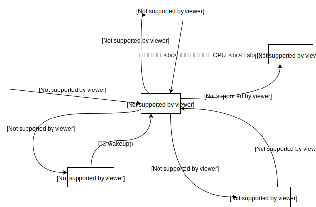

# Lab6: 调度算法
## 实验目的
* 理解操作系统的调度机制
* 熟悉 rcore 的调度框架
* 实现新的调度算法

## 上下关系
lab5 完成后， 我们可以在 rcore 上运行多个用户进程了。
但是我们采用的调度策略是简单的 round-robin 策略， 而实际中我们会有优先级和公平等等概念。
这就导致我们需要实现更加有效的 *调度算法* 来支持。

## 系列练习
本实验中， 你需要在理解指导书内容的情况下， 选择下面一个项目实现到 rcore 中
- 参考 rcore 中的 round-robin 调度器， 实现 stride 等高级调度算法。
- 实现多核下的负载均衡机制

## 实验原理
进程调度相关的内容都在 `rcore_process` crate 中， 以下若无特殊说明， 我们讨论均在该 crate 中。
我们结合 rcore 源代码来分析， 进程调度的管理具体是怎么做的。

### 进程状态
进程运行时， 有不同的状态。 在 rcore 中， 状态在 `process_manager::Status` 中定义， 如
```rust
#[derive(Debug, Clone, Eq, PartialEq)]
pub enum Status {
    Ready,
    Running(usize),
    Sleeping,
    Waiting(Pid),
    /// aka ZOMBIE. Its context was dropped.
    Exited(ExitCode),
}
```
其中
* Ready: 随时可以运行
* Running: 在某个 CPU 上执行。 它的域标识了在哪个 CPU 上执行， 值等于该 CPU 的 cpuid。
* Sleeping: 对应 sleep 系统调用。 等待一段时间后被唤醒。
* Waiting: 对应 wait 系统调用。 等待某个/所有子线程退出。
* Exited: 退出后状态。

进程的正常生命周期如


### 将多个进程组织起来
所有的进程， 无论什么状态， 都被 `process_manager::ProcessManager` 管理。
`ProcessManager` 直接控制了所有进程的状态切换。 所有外部模块要修改进程的状态， 都必须通过 `ProcessManager`。
它们的进程控制块都放在 `ProcessManager::procs` 中。

而 `ProcessManager` 和内核中代表进程的Process类型之间的衔接桥梁是 `processor::Processor`。`processor::Processor`类型的全局静态数组PROCESSORS中，每个元素对应一个物理处理器核， 且该类型包含了一个 `ProcessManager`。
可以理解这是一种设计， 这样使得一个进程可以运行在不同的 CPU 上，从而提高多CPU系统的整体利用率。

```rust
/// Process executor
///
/// Per-CPU struct. Defined at global.
/// Only accessed by associated CPU with interrupt disabled.
#[derive(Default)]
pub struct Processor {
    inner: UnsafeCell<Option<ProcessorInner>>,
}

unsafe impl Sync for Processor {}

struct ProcessorInner {
    id: usize,
    proc: Option<(Pid, Box<Context>)>,
    loop_context: Box<Context>,
    manager: Arc<ProcessManager>,
}
```

如果PROCESSORS[i]同时加入不同的新进程到 `ProcessManager`，则需要考虑 `ProcessManager`的互斥访问。
并且从下面可以看到， `ProcessManager` 自己保留一个调度器， 使用这个调度器来选择每次运行那个进程。
至于 `event_hub`， 是用来完成 sleep 等事件驱动的特性。

```rust
pub struct ProcessManager {
    procs: Vec<Mutex<Option<Process>>>,
    scheduler: Mutex<Box<Scheduler>>,
    event_hub: Mutex<EventHub<Event>>,
}
```

那么核心内核是怎么调用 `ProcessManager` 的呢?
系统启动之后， 进入 `kmain` 之前在 `rcore::process::init` 中， 创建了 `ProcessManager` 和多个 `Processor`

```rust
pub fn init() {
    let scheduler = Box::new(scheduler::RRScheduler::new(5));
    let manager = Arc::new(ProcessManager::new(scheduler, MAX_PROCESS_NUM));
    unsafe {
        for cpu_id in 0..MAX_CPU_NUM {
            PROCESSORS[cpu_id].init(cpu_id, Process::new_init(), manager.clone());
        }
    }
```

而 `kmain` (每个 CPU 都会执行 `kmain`， 不管是启动根CPU（第一个启动的CPU），还是附属 CPU (AP)) 中只有一条语句， 实现了所谓的不断选择进程运行的循环。

```rust
pub fn kmain() -> ! {
    processor().run();
}
```

具体而言， `processor.run` 是一个无限循环， 不断执行
1. 调用 `manager.run()`， 选择一个就绪进程
2. 调用底层切换 `swtch` 函数完成进程切换
3. 运行一定时间片段后调用 `manager.stop()` 结束当前进程的运行。

### 抢占调度和 rcore 内核
对于用户进程而言， 它执行的过程中， 随时都有可能产生时钟中断， 然后操作系统让发现用户进程耗尽规定的时间片， 从而导致用户进程被调度出当前CPU。
因此， 用户进程随时都是可能被抢占的。 这体现了用户进程是随时 *可抢占的 (preemptive)*。 通常这也称为， 用户进程是 可*抢占调度的 (preemptively scheduled)*。

对于内核线程而言，那么存在同样的问题是:

> 是否内核线程也是随时可抢占的?

事实上， rcore 内核是可抢占的， 这和 ucore 内核不同。
如果要实现可抢占内核， 那么全局数据结构的访问都要加锁。 对于 C 实现的 ucore 来说这是很麻烦而且易错的。
但是 Rust 在语言层面就要求开发者考虑并发问题， 因此所有全局数据默认就是加锁的。

### 调度器接口
调度算法多种多样， 有简单的 round-robin 和 FIFO， 有强调公平性的 lottery / stride， 还有强调区分优先级的调度算法。
因此我们需要设计合理的接口， 让这些算法都能在接口的限制下实现。

首先，一个关键的需求是：
* 每次有空闲的 CPU 的时候， scheduler 能找出一个可运行的 Ready 状态进程， 放到该 CPU 上执行

我们不希望调度器直接操作 `ProcessManager::procs`， 遍历所有进程。 实际系统中有很多进程， 但可运行的可能很少。
因此调度器只需要考虑可运行的所有进程， 将它们组织成一个 *运行队列 (run queue)*。
注意事实上， 运行队列底下的数据结构不一定是 FIFO 队列， 可能是优先队列， 可能是平衡二叉搜索树等。
那么为了维护这个运行队列， 我们需要支持
* 入队: 通知调度器， 有新的进程变为 Ready
* 出队: 通知调度器， 某进程不再是 Ready 了

在我们的实现中， 正在运行的进程不在运行队列中。

**TODO: 作为练习， 让学生回答为什么要这么设计。 答案:
因为在多核的情况下， 如果正在运行的进程也在运行队列中， 那么可能同时有多个 CPU 运行同一进程。
为了简单， 要求在 50 字以内。**

另外， 调度器需要知道时钟中断的信息。
这是必要的， 因为Ready类型的进程的等待时间可能影响它被选择运行的可能性， 而维护 Running类型的进程所余下的时间片会影响它后续执行的时间。这两种时间信息都需要通过时钟中断来保证及时更新和维护。
因此还需要
* 每次时钟外设产生中断后， 操作系统能通知调度器 "发生了时钟中断"， 以便其更新维护进程中的相关信息。

另外， 我们还要支持优先级的概念， 不然只能实现非常简单的调度算法。
* 设置某进程的优先级

在 rcore 中， 调度器的接口是 `scheduler::Scheduler`， 如
```rust
pub trait Scheduler {
    fn insert(&mut self, pid: Pid);
    fn remove(&mut self, pid: Pid);
    fn select(&mut self) -> Option<Pid>;
    fn tick(&mut self, current: Pid) -> bool;   // need reschedule?
    fn set_priority(&mut self, pid: Pid, priority: u8);
}
```

容易看出, 其中用 `Pid` 标识进程, 并且五个接口对应上面说的五个需求。
`tick` 返回一个 bool, 表示这个时钟中断后, 是否需要调度。
如果为 `false`, 那么接下来还是当前进程运行; 否则强制当前进程放弃 CPU
```rust
// processor::Processor::tick
  // ...
  let need_reschedule = self.manager().tick(self.pid());
  // ...
  if need_reschedule {
    self.yield_now();
  }
  // ...
```

## 调度器和进程管理的交互
从[前面的代码](#将多个进程组织起来)可以看到, `ProcessManager` 中有一个调度器 `scheduler: Mutex<Box<Scheduler>>`。
初始化 `ProcessManager` 的时候指定了这个调度器。

`ProcessManager` 的诸方法中调用 `Scheduler` 的方法, 具体有

| `Scheduler` 的方法 | `ProcessManager` 什么时候调用 | 解释 |
| --- | --- | --- |
| `insert` | `add`, `stop`, `set_status` | 有新的 Ready 进程, 需要添加到运行队列中. `add` 是新创建的进程; 而 `stop` 中如果是因为时间片耗尽, 而非阻塞, 那么停止后进程还应当在运行队列中; `set_status` 被 `wakeup` 等调用, 让某个沉睡的进程变为 Ready. |
| `remove` | `run`, `set_status` | 进程从 Ready 状态变成其他状态, 需要从运行队列中溢出. `run` 是因为j正在运行的进程不在运行队列中; 而 `set_status` 可能让进程阻塞从而不再是 Ready 状态. |
| `tick` | `tick` | 每次时钟中断, 处理例程调用 `Processor.tick()` 然后它调用 `ProcessManager.tick()`, 最后调用 `Scheduler.tick()` 维护运行队列信息. |
| `set_priority` | `set_priority` | 这个很直观, 和上面类似. 不过 `set_priority` 是从系统调用一路调用过来, 而上面是从时钟中断一路调用过来. |
| `select` | `run` | 某个 CPU 上的 `run` 调用 `select` 选择可运行的进程, 然后运行它. |

## round-robin 调度算法
round-robin (后称 rr) 算法的思想非常简单: 所有 Ready 的进程平等, 不存在优先级, 轮流使用 CPU。具体调度过程如下：
* rr 将运行队列组织成线性链表
* 每次选择链表头的进程, 作为本次运行的进程
* 本次进程的时间片用完后, 放到链表尾部
* 重复上述三步

## Stride 调度算法的基本思路
Stride 调度算法引入了优先级的概念, 其特点是：
* 进程分配到的 CPU 时间和他的优先级成正比
* 是确定性（即不存在随机调度因素）的调度算法
* 相对容易实现

基本思想是，对于每个进程 $p$ ，具有属性 $p.S \in \mathbb{R}$, 称其 stride。 另外记 $p.P$ 为其优先级。
若 $p$ 被调度运行，则让 $p.S$ 增加 $\frac{1}{p.P}$。
每次选择 stride 最小的 $p$ 运行。

为简化分析，假设在不考虑插入删除进程，不考虑改变优先级的前提下，一个直观的解释是：高优先级的进程 stride 增加更加缓慢。
假设最初所有进程的 $p.S = 0$ 的话, 那么因为高优先级的进程 $p.S$ 增加缓慢, 所以 stride 最小的 $p$ 是高优先级进程的可能更大。这也就实现了 "高优先级进程分配到更多 CPU 时间" 的目标。

至于定量地 "分配到的 cpu 时间和优先级成正比", 利用高中水平的数学即可证明。 请同学们自行确认。

## Stride调度算法的设计实现
具体实现中, 我们需要处理的问题是

1. $p.S$ 要用整数模拟, 不能用实数或浮点. 使用 32 位无符号整数表示。
  - 同学们可以采取的一种方案是, 每次调度运行后 $p.S$ 增加不是 $\frac{1}{p.P}$,
    而是 $\left\lfloor \frac{B}{p.P} \right\rfloor$, 其中 $B$ 是一个确定的大常数。
  - 性质：任一时刻, 任两进程 $a, b$, 有 $|a.S - b.S| < \max\{\frac{B}{x.P}\;|\; x \text{是任一进程}\}$.
    归纳即可证明。

2. 实际计算机中, 计算可能溢出, 如在 u32 计算中 `0xFFFFFFFE + 10 == 8`。
  溢出影响的主要是比较大小。 具体可看如下例子。
  - 假设只有两个进程 $a$ 和 $b$, 优先级相同。
  - 某次调度前, 它们的 stride 均为 0xFFFFFFFE。
  - 调度 $a$ 运行, $a$ 运行完后其 stride 溢出。 导致它们的 stride 为 $a: 8, \; b: 0xFFFFFFFE$
  - 按照优先级假设, 我们现在应该调度 $b$ 运行。 但是选择最小却选择了 $a$。

为解决溢出问题，可以采用的一个方法是：设 $a, b$ 都是 32 位无符号数，加减运算按照无符号数的规则溢出。
但是比较的时候, 若 $a-b < 2^{31}$, 则称 $a > b$。 直观意义请自行思考。
这样的话, 我们只需要保证前面 $B​$ 的设计使得 stride 的变化量不超过 $2^{31}​$ 即可。

3. 改变优先级的情况: 很明显每次改变 $p.S$ 的时候, 使用当时的 $p.P$ 计算 $p.S$ 的增量。

4. 插入删除进程的情况: 删除较容易。 插入的话, 新进程的 $p.S$ 应该是多少?
  - 如果在其他进程 $p.S$ 都很大的时候插入新进程, 其 $p.P$ 是 0, 那么这可能不太合理?
  - 采用平均值? 最小值? 请自行设计验证。

另外 stride调度算法需要实现优先队列, 同学们可使用 `alloc::collections::BinaryHeap`。
